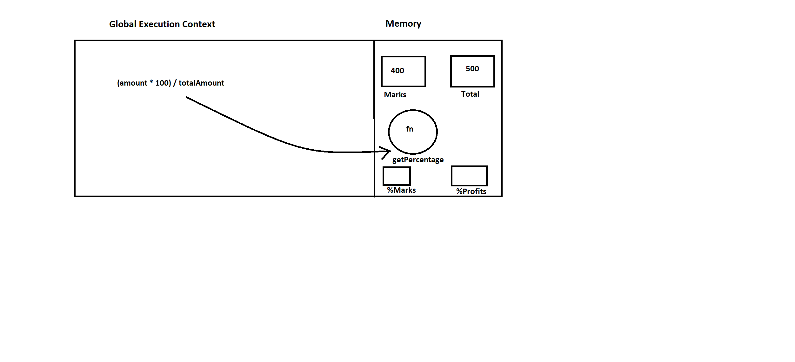
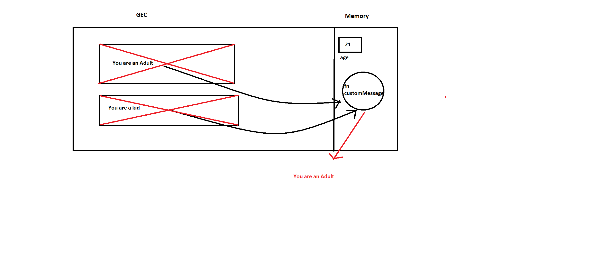

1. What does thread of execution means in JavaScript?
<!-- JavaScript follows line by line code execution which is in turn called as Thread of Execution -->
2. Where the JavaScript code gets executed?
<!-- JavaScript Code gets executed inside of Gloabl Execution Context -->
3. What does context means in Global Execution Context?
<!-- Meaning it creates a volatile memory and stores variables and their values -->
4. When do you create a global execution context.
<!-- Whenever we write a piece of JavaScript, Global Execution Context is created -->
5. Execution context consists of what all things?
<!-- Consists of memory space and execution space -->
6. What are the different types of execution context?
<!-- Global Execution Context and Function Execution Context -->
7. When global and function execution context gets created?
<!-- Whenever JavaScript is written inside .js file GEC is created and in that file if we have declared any function then function execution context is created. -->
8. Function execution gets created during function execution or while declaring a function.
<!-- During function execution -->

9. Create a execution context diagram of the following code on your notebook. Take a screenshot/photo and store it in the folder named `img`. Use `` to display it here.
`[](./img/execution-context-diagram.png)`


```js
var user = "Arya";

function sayHello(){
  return `Hello ${user}`;
}

var userMsg = sayHello(user);
```

<!-- Put your image here -->
`[](./img/execution-context-diagram.png)`


```js
var marks = 400;
var total = 500;

function getPercentage(amount, totalAmount){
  return (amount * 100) / totalAmount;
}

var percentageMarks = getPercentage(marks, total);
var percentageProfit = getPercentage(400, 200);
```

<!-- Put your image here -->




```js
var age = 21;

function customeMessage(userAge){
  if(userAge > 18){
    return `You are an adult`;
  }else {
    return `You are a kid`;
  }
}

var whoAmI = customeMessage(age);
var whoAmIAgain = customeMessage(12);
```

<!-- Put your image here -->

